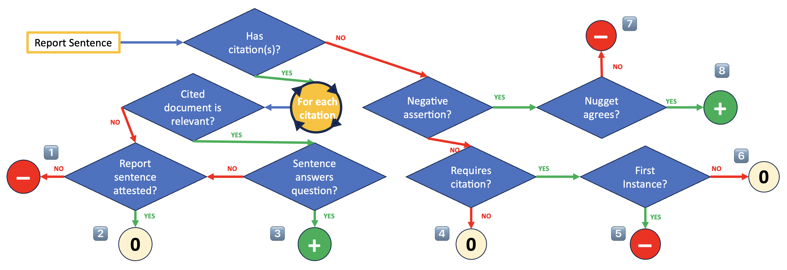

# Report Generation Evaluator
### This repository is in progress

This repository implements the evaluation framework from ["On the Evaluation of Machine-Generated Reports"](https://arxiv.org/abs/2405.00982) (Mayfield et al., SIGIR 2024). It provides tools for systematically evaluating AI-generated reports based on citation usage, factual accuracy, and information coverage.

## Table of Contents
- [Installation](#installation)
  - [Option 1: Using UV (Recommended)](#option-1-using-uv-recommended)
  - [Option 2: Using pip](#option-2-using-pip)
- [Configuration](#configuration)
- [Document Lookup Setup](#document-lookup-setup)
- [Usage](#usage)
- [Testing](#testing)
- [Evaluation Framework](#evaluation-framework)
- [Citation](#citation)

## Installation

### Option 1: Using UV (Recommended)

Quick install:
```bash
git clone https://github.com/orionweller/report_gen_eval.git && cd report_gen_eval
chmod +x uv_install.sh && ./uv_install.sh
```

<details>
<summary>Click for detailed installation steps</summary>

1. Install UV (if not already installed):
```bash
curl -LsSf https://github.com/astral-sh/uv/releases/latest/download/uv-installer.sh | sh
```

2. Clone and set up the environment:
```bash
git clone https://github.com/orionweller/report_gen_eval.git
cd report_gen_eval
chmod +x uv_install.sh
./uv_install.sh
```

3. Activate the environment:
```bash
source env/bin/activate
```

4. Install in development mode:
```bash
uv pip install -e .
```
</details>

### Option 2: Using pip

Quick install:
```bash
pip install git+https://github.com/orionweller/report_gen_eval.git
```

<details>
<summary>Click for development installation</summary>

```bash
git clone https://github.com/orionweller/report_gen_eval.git
cd report_gen_eval
pip install -e .
```
</details>

## Configuration

The evaluator uses LangChain to interact with various LLM providers:
- Together AI (default)
- OpenAI
- Anthropic

<details>
<summary>Click to view API configuration details</summary>

Create a `.env` file with your API key(s):
```bash
TOGETHER_API_KEY=your_api_key_here
OPENAI_API_KEY=your_openai_key_here  # Optional
ANTHROPIC_API_KEY=your_anthropic_key_here  # Optional
```
</details>

## Document Lookup Setup

The evaluator requires access to source documents to verify citations. Clone the document lookup repository:
```bash
git clone https://huggingface.co/datasets/orionweller/neuclir-docs-lookup
```

<details>
<summary>Click for detailed document lookup information</summary>

### Available Collections
The document lookup system supports:
- `neuclir/1/zh` (Chinese documents)
- `neuclir/1/fa` (Farsi documents)
- `neuclir/1/ru` (Russian documents)

### Collection ID Mapping
Common variants are automatically handled:
- Chinese: `neuclir/1/zh` or `neuclir/1/zho`
- Farsi: `neuclir/1/fa` or `neuclir/1/fas`
- Russian: `neuclir/1/ru` or `neuclir/1/rus`

### Memory Usage
- Documents are loaded on first access
- Cache is shared across evaluations
- Cache persists until program exits
- Each collection typically requires 1-2GB of memory

Tips for memory management:
- Process reports in smaller batches
- Clear cache between large batches
- Monitor memory usage with `--verbose` flag
</details>

## Usage

Basic usage:
```bash
report-eval data/dev_reports_one.jsonl data/dev_nuggets_one.jsonl results/ --batch-size 1 --verbose
```

<details>
<summary>Click for detailed usage information</summary>

### Command Line Interface

With specific model provider:
```bash
report-eval tests/assets/example_input_one_only.jsonl tests/assets/example_nuggets.jsonl results/ -p openai -m gpt-4-0125-preview
```

### Input Format

The input JSONL file should contain report entries with this structure:
```json
{
  "request_id": "300",
  "run_id": "example-run",
  "collection_ids": ["collection1"],
  "sentences": [
    {
      "text": "Japan experienced a significant increase in suicide rates during the COVID-19 pandemic.",
      "citations": ["56b44b0f-fd8d-4d81-bae9-7f8d80e6b745"]
    }
  ]
}
```

The nuggets file should contain evaluation criteria in this format:
```json
{
  "query_id": "300",
  "test_collection": "rus_2024",
  "query_text": "Example query text for testing",
  "hash": 1111,
  "items": [
    {
      "query_id": "300",
      "info": {
        "importance": "vital",
        "used": false
      },
      "question_id": "300_test",
      "question_text": "How much did suicides rise by in 2020?",
      "gold_answers": ["3.7%"]
    }
  ]
}
```

### Python API

```python
from report_gen_eval import evaluate_report, ModelProvider

# Example report evaluation
sentences = [
    {
        "text": "Japan experienced a significant increase in suicide rates during the COVID-19 pandemic.",
        "citations": ["56b44b0f-fd8d-4d81-bae9-7f8d80e6b745"]
    }
]

report = {
    "request_id": "300",
    "run_id": "example-run",
    "collection_ids": ["collection1"],
    "sentences": sentences
}

results = evaluate_report(
    report,
    nuggets_file="tests/assets/example_nuggets.jsonl",
    provider=ModelProvider.TOGETHER,
    model_name="meta-llama/Llama-3.3-70B-Instruct-Turbo"
)
```
</details>

## Testing

Run the test suite:
```bash
python -m pytest tests/
```

<details>
<summary>Click for specific test examples</summary>

Run specific prompting tests:
```bash
python -m pytest tests/test_prompts.py -k test_check_relevance -v
python -m pytest tests/test_prompts.py -k test_requires_citation -v
python -m pytest tests/test_prompts.py -k test_nugget_agreement -v
python -m pytest tests/test_prompts.py -k test_check_negative -v
python -m pytest tests/test_prompts.py -k test_first_instance -v
```
</details>

## Evaluation Framework

The framework evaluates AI-generated reports based on citation usage, factual accuracy, and information coverage.

<details>
<summary>Click for detailed evaluation process</summary>



### For Sentences Without Citations:

1. If the sentence contains a negative statement ("X is not true"):
   - Reward (+1) if a nugget confirms this statement
   - Penalize (-1) if no nugget supports this claim
   
2. For statements requiring citations:
   - Penalize (-1) if it's the first occurrence of the claim
   - Ignore (0) if the claim was previously cited
   
3. For statements not requiring citations (e.g., introductory text):
   - Ignore (0)

### For Sentences With Citations:

1. Check if each cited document supports the claim:
   - Penalize (-1) if any document doesn't support the claim
   - Continue to step 2 if all documents support the claim

2. Check nugget matching:
   - Reward (+1) for each nugget the sentence correctly answers
   - Ignore (0) if no nuggets are matched


### Scoring Metrics

The framework calculates two primary metrics:

- **Recall** = (Number of unique nuggets correctly reported) / (Total number of nuggets)
- **Precision** = (Number of rewarded sentences) / (Total scored sentences)

Important Notes:
- A sentence can receive multiple rewards for matching multiple nuggets
- Each unique nugget counts only once for recall
- Ignored sentences (score=0) don't affect precision
- Any penalized sentence (-1) counts against precision
</details>

## Citation

If you use this evaluation framework in your research, please cite:

This implementation:
```bibtex
TODO
```

The original framework:
```bibtex
@inproceedings{Mayfield2024OnTE,
  title={On the Evaluation of Machine-Generated Reports},
  author={James Mayfield and Eugene Yang and Dawn J Lawrie and Sean MacAvaney and Paul McNamee and Douglas W. Oard and Luca Soldaini and Ian Soboroff and Orion Weller and Efsun Kayi and Kate Sanders and Marc Mason and Noah Hibbler},
  booktitle={Annual International ACM SIGIR Conference on Research and Development in Information Retrieval},
  year={2024},
  url={https://api.semanticscholar.org/CorpusID:269502216}
}
```
